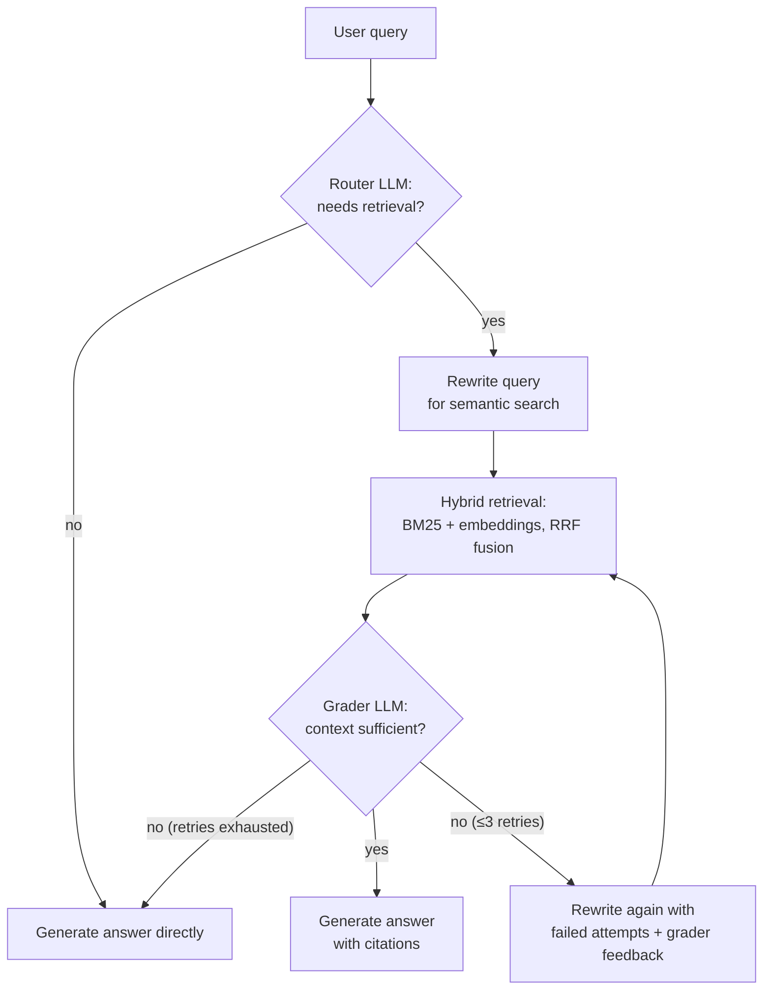

# Agentic RAG

[](https://github.com/Kevin-Eleven/agentic-rag/actions/workflows/ci.yml)
[](LICENSE)

A **hand-built agentic RAG pipeline** — no LangChain, no LlamaIndex — that answers questions about your PDFs with cited sources. An LLM router decides whether a query needs retrieval at all, a grader checks whether the retrieved context can actually answer the question, and a feedback-driven self-correction loop rewrites the query and retries when it can't.

Built with **Groq (Llama 3.3 70B)**, **ChromaDB**, and **sentence-transformers**, wrapped in a Streamlit chat UI that exposes the full pipeline trace.

## Architecture



Every stage emits a structured log line (decision, timing, token usage), so a single query produces a readable trace of what the pipeline did and why.

## Why it's built this way

- **Hand-built, not framework-glued.** Every step — routing, rewriting, retrieval fusion, grading, retrying — is ~15 lines of readable Python. The point of the project is understanding the machinery, not hiding it.
- **Hybrid retrieval with reciprocal rank fusion.** Dense embeddings miss exact keywords ("NOC", "CCDC"); BM25 misses paraphrases. Both rankings are fused with RRF so a chunk favored by only one signal can still surface.
- **Self-correction with feedback, not re-rolls.** When the grader rejects the retrieved context, the rewriter is shown its previous failed rewrites *and the grader's reason*, so each retry is a genuinely different query instead of a re-roll of the same prompt.
- **Structured decisions.** The router and grader answer in JSON mode at temperature 0 (with a plain-text fallback), not by string-matching a free-form reply.
- **Citations by construction.** Chunks keep their source file and page number from ingestion all the way to the answer, which cites them as `[1]`, `[2]`.
- **Resilient LLM client.** Timeouts, exponential-backoff retries on rate limits and 5xx, and a clean `LLMError` instead of a stack trace from a raw `requests` call.
- **Cached workflow.** Identical queries skip the whole pipeline via an LRU cache.

## Quickstart

```bash
git clone https://github.com/Kevin-Eleven/agentic-rag.git
cd agentic-rag
pip install -e ".[dev,ui]"

cp .env.example .env   # add your GROQ_API_KEY (free at console.groq.com/keys)
```

Ingest a PDF, then ask questions:

```bash
python -m retrieval.ingestion path/to/document.pdf
python main.py                      # CLI chat with cited sources
streamlit run ui/app.py             # chat UI with pipeline-trace panel + PDF upload
```

Or with Docker:

```bash
docker compose up --build           # UI on http://localhost:8501
```

## Evaluation

The repo ships an evaluation harness (`eval/`) that measures the two things a RAG system can get wrong — retrieving the wrong context and answering unfaithfully:

- **Retrieval quality**: hit rate and MRR over a golden question set, comparing dense-only retrieval against hybrid BM25+embedding retrieval.
- **Answer quality**: an LLM judge scores each answer 1–5 for correctness against a reference answer and faithfulness to the retrieved context.

```bash
python -m eval.run_eval               # full eval (LLM judge needs GROQ_API_KEY)
python -m eval.run_eval --skip-judge  # retrieval metrics only, no LLM calls
```

It prints a markdown table ready to paste here. Curate `eval/golden_set.json` for whichever document you ingest — each item has a question, a reference answer, and the keywords/pages a correct retrieval must contain.

## Project structure

```
agents/       router, query rewriter, retrieval grader, answer generator
workflow/     the agentic loop tying the agents together (+ LRU cache)
retrieval/    page-aware chunking, ingestion CLI, ChromaDB hybrid store
llm/          Groq client (retries, timeouts, JSON mode) and prompts
eval/         golden set + retrieval/answer-quality harness
ui/           Streamlit chat app with pipeline-trace panel
config/       env-driven settings
utils/        structured stage logging + timing decorator
tests/        40 unit/integration tests (all LLM and DB calls mocked)
```

## Running tests

```bash
pytest -v
ruff check .
```

CI runs both on every push.

## License

[MIT](LICENSE)
